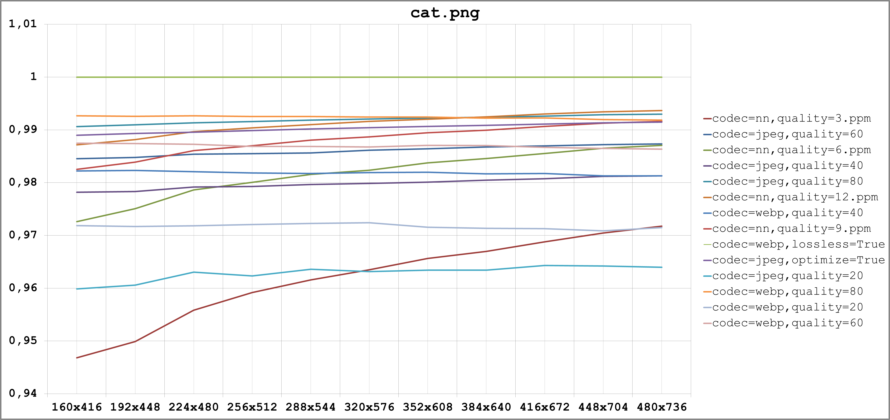
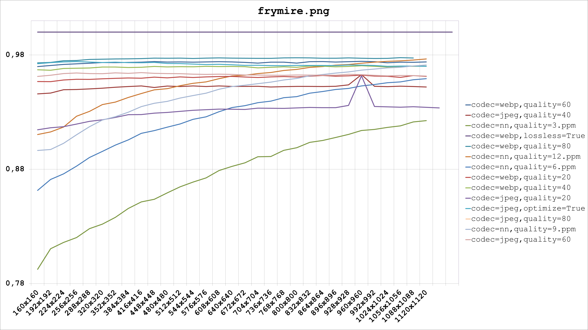
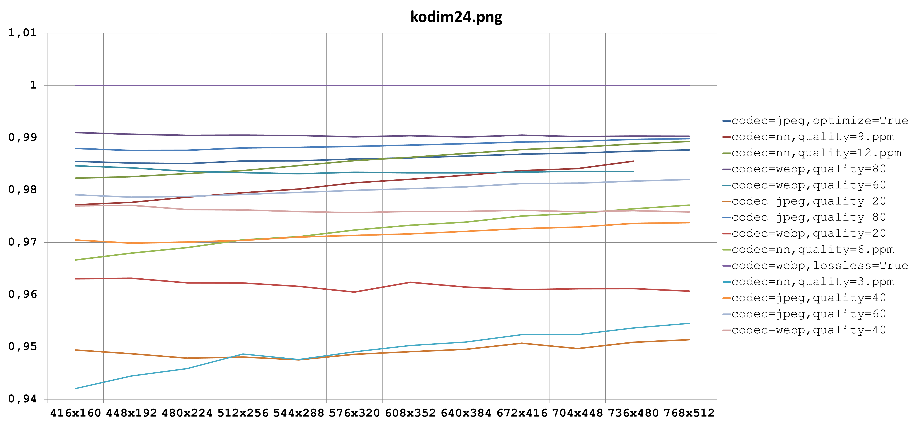
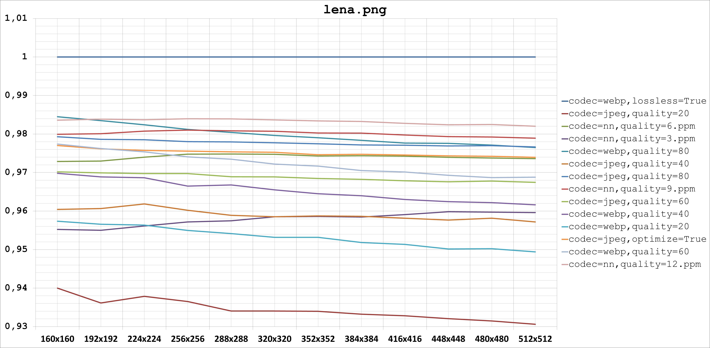

# Image Compression Benchmarking

This project inspired by Google's paper ***Full Resolution Image Compression with Recurrent Neural Networks*** ([arxiv](https://arxiv.org/abs/1608.05148)) and its TensorFlow [implementation](https://github.com/tensorflow/models/tree/master/compression).

The code inside aims to compare (quantitatively and qualitatively) different aspects of compression done by this **method** and codecs popular today, in different compression levels, for different image resolutions.

# Requirements

Hardware:

* **GPU is not necessary** but preferable
* At least 3Gb of RAM

Software:

* [Ubuntu](https://www.ubuntu.com/) 14.04+ (tested)
* [TensorFlow](https://www.tensorflow.org/)
* [Pillow](https://python-pillow.org/) 3.4+
* [NumPy](http://www.numpy.org/) 1.11+

# Installation

1. First, install suitable TensorFlow version. See instruction [here](https://github.com/tensorflow/tensorflow/blob/master/tensorflow/g3doc/get_started/os_setup.md).

2. Install other project dependencies:

    `./install_deps.sh`

# HowTo

First, download Google's pre-trained model via `download_model.sh`. It required for all further actions.

---

If you want just to try Google's model, you should run `python nn_compression_example.py` with following parameters:

* `--image=/path/to/image` - path to image;
* `--quality=0|...|15` - level of compression, default is `8`;
* `--model=/path/to/model` - pre-trained model file, default is `google's-compression-model/residual_gru.pb`.

Notice that the `image` should have width and height multiple of 32 according the **paper**.

---

If you want to (re)run benchmarking, you should first prepare the set of test images by executing `generate_test_samples.sh`. 

Otherwise, you can **successively** run `python generate_test_samples_regular.py` and `python generate_test_samples_nn.py`. First one will generate some test samples, comressed with the regular codecs (list of codecs you can find in the code) and also reshapes images to be multiple of 32 by both sides. Second script will generate a bunch of test samples, comressed using the **method** encoding. You can specify the following parameters for the last one:

* `--image_tmpl=root/to/images` - `regex` template to images to be compressed, default is `test_images/*_orig.ppm`;
* `--quality=0|...|15,...,0|...|15` - levels of compression, default is `3,6,9,12`;
* `--model=/path/to/model` - pre-trained model file, default is `google's-compression-model/residual_gru.pb`.

It required once if you don't want to change comression parameters or images set.

Finally, run `python benchmark_quality_msssim.py` for quality benchmarking based on MS-SSIM metric. It will generate results in `CSV` format.

# Results

Bellow you can see the quality benchmarking result based on MS-SSIM metric for a bunch of images. Clearly seen , that the quality of **method**'s compression depends on image resolution.

# License
All files in *google* subfolder have a license from the original project and was taken from tensorflow/models@76739168f61dd9bb849e500bbd235fa9e4b7612f .

License for the google's compression model (*google's-compression-model*) described in its **LICENSE** file.

Images for this project taken from the publicly available datasets, precisely

* [Public-Domain Test Images for Homeworks and Projects](http://homepages.cae.wisc.edu/~ece533/images/)
* [Kodak Lossless True Color Image Suite](http://r0k.us/graphics/kodak/)

All files, that are the heritage of the project, subjects to WTFPL (see **LICENSE** file in the root).